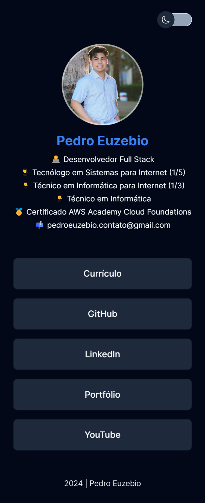
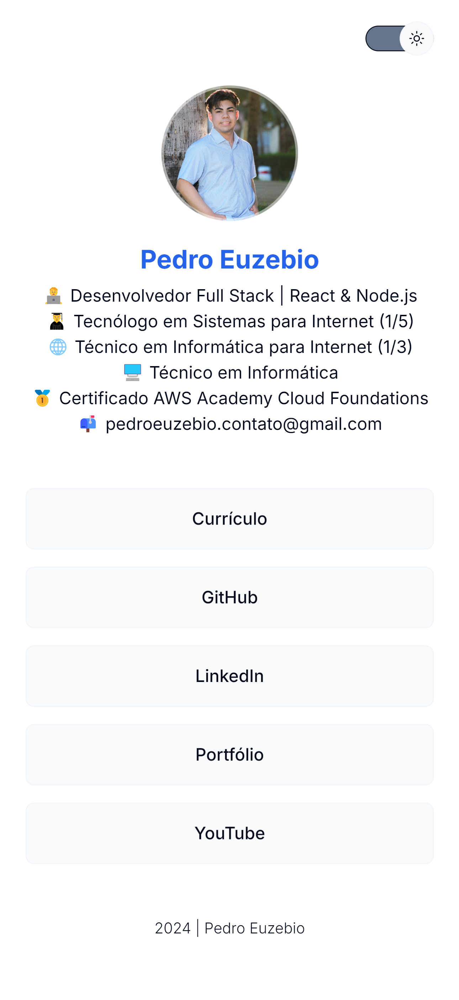
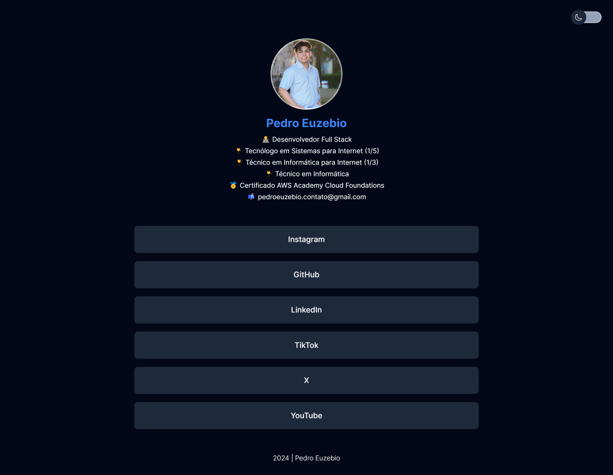
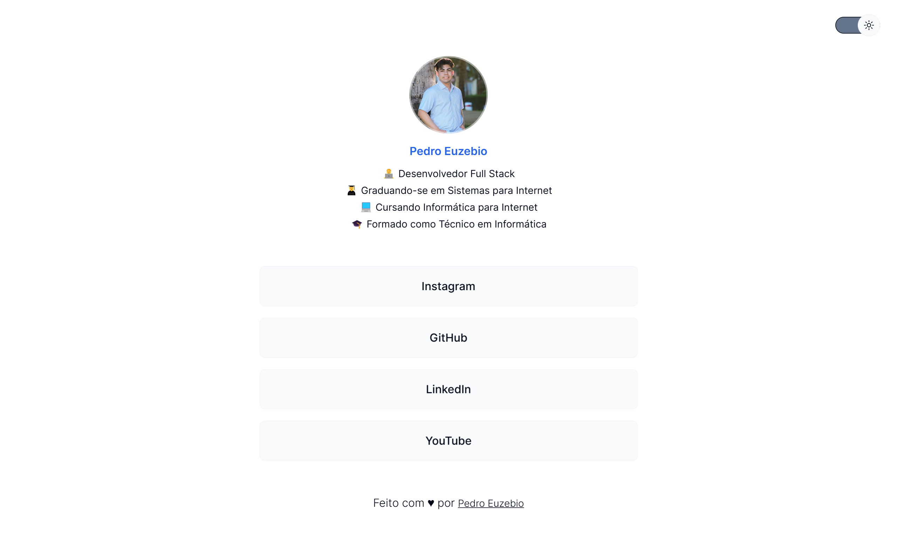

<h1 align="center">
  <a href="https://pedroeuzebio-links.vercel.app">
    Pedro Henrique Links
  </a>
</h1>

# Roteiro

- [Versão Mobile](#versão-mobile)
  - [Modo Escuro](#modo-escuro)
  - [Modo Claro](#️modo-claro)
- [Versão Desktop](#️versão-desktop)
  - [Modo Escuro](#modo-escuro)
  - [Modo Claro](#️modo-claro)
- [Sobre](#sobre)
- [Tecnologias](#️tecnologias)
- [Pré-requisitos](#pré-requisitos)
- [Instalação](#instalação)
- [Executando](#️executando)
- [Deploy](#deploy)
- [Autor](#autor)
- [Licença](#licença)

# Versão Mobile

## Modo Escuro

<p align="center">
  <a href="https://pedroeuzebio-links.vercel.app">
    
  </a>
</p>

## Modo Claro

<p align="center">
  <a href="https://pedroeuzebio-links.vercel.app">
    
  </a>
</p>

# Versão Desktop

## Modo Escuro

<p align="center">
  <a href="https://pedroeuzebio-links.vercel.app">
    
  </a>
</p>

## Modo Claro

<p align="center">
  <a href="https://pedroeuzebio-links.vercel.app">
    
  </a>
</p>

# Sobre

Desenvolveu um agregador de links responsivo com troca de tema, utilizado como cartão de visitas digital.

# Tecnologias

O projeto foi desenvolvido com as seguintes tecnologias:

- [HTML](https://developer.mozilla.org/pt-BR/docs/Web/HTML)
- [CSS](https://developer.mozilla.org/pt-BR/docs/Web/CSS)
- [JavaScript](https://developer.mozilla.org/pt-BR/docs/Web/JavaScript)

# Pré-requisitos

Verifique aos seguintes pré-requisitos para poder instalar e executar o projeto:

1. Ter instalado um editor de código: [VS Code](https://code.visualstudio.com/download)
2. Ter instalado o [Git](https://git-scm.com/downloads)
3. Ter instalado a extensão [Live Server](https://marketplace.visualstudio.com/items?itemName=ritwickdey.LiveServer)

# Instalação

Siga o passo a passo para instalar o projeto:

1. Abra o terminal e clone o repositório do projeto:

```bash
git clone https://github.com/pedroeuzebiooo/pedroeuzebio-links
```

# Executando

Siga o passo a passo para executar o projeto:

1. Entre na pasta do projeto clonado:

```bash
cd pedroeuzebio-links
```

2. Abra a pasta do projeto clonado no editor de código de sua preferência. Caso seja o [VS Code](https://code.visualstudio.com/download) digite o comando:

```bash
code .
```

3. Abra o arquivo `index.html` com a extensão [Live Server](https://marketplace.visualstudio.com/items?itemName=ritwickdey.LiveServer) do VS Code

# Deploy

- [Exibir projeto](https://pedroeuzebio-links.vercel.app)

# Autor

<table>
  <tr>
    <td align="center">
      <a href="https://github.com/pedroeuzebiooo">
        
      </a>
      <br>
      Pedro Euzebio
    </td>
  </tr>
</table>

# Licença

O projeto está sob licença MIT. Veja o arquivo [LICENSE](./LICENSE) para mais detalhes.
